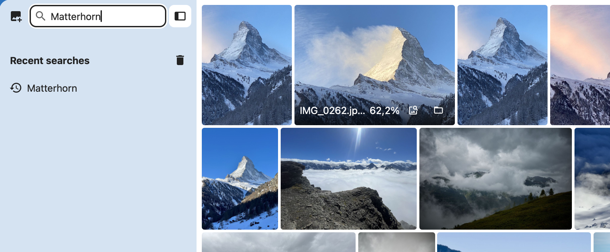
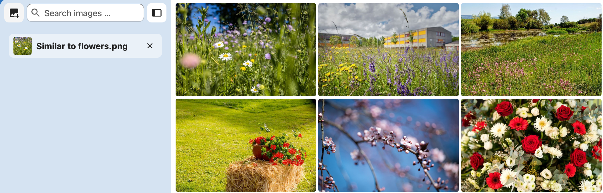

# Media Embedding Connector

[](https://nextcloud.com/)
[](LICENSE)

Search Nextcloud images with text, an existing image, or a picture dropped from
your device. The app uses an administrator-configured Media Embedding Service and
Elasticsearch. Nextcloud checks file permissions before returning results.

[Source and releases](https://github.com/Digitale-Medien-der-Armee-DMA/media_embedding_connector)

Developed by [Digitale Medien der Armee (DMA)](https://dma.swiss).

## Screenshots

### Search with text

Describe what you are looking for, such as “Matterhorn”, to find matching images.



### Search with an image

Drop a reference image onto the search field to find visually similar photos.



## Requirements

- Nextcloud 32–34 and PHP 8.2–8.5
- Elasticsearch 8.12 or newer
- A compatible Media Embedding Service at `/api/external/v1`
- Nextcloud cron for background indexing

The current adapter targets the MediaLab External API. Other Media Embedding
Services must implement the same endpoints and contract; see the
[service requirements](docs/ADMIN_GUIDE.md#service-compatibility).

JPEG, PNG, and WebP are supported. GIF also requires support from the configured
model. Administrators can restrict formats further.

## Install

Download `media_embedding_connector-<version>.tar.gz` and its checksum from
the release page. GitHub's automatically generated source archives are not
installable app packages.

Verify and extract the archive on the Nextcloud server:

```bash
sha256sum -c media_embedding_connector-<version>.tar.gz.sha256
tar -xzf media_embedding_connector-<version>.tar.gz -C /path/to/nextcloud/apps
```

From the Nextcloud installation directory:

```bash
sudo -u www-data php occ app:enable media_embedding_connector
```

To restrict access to selected groups:

```bash
sudo -u www-data php occ app:enable media_embedding_connector --groups media-ai --groups archive
```

The same restrictions apply to search, file events, and background indexing.

## Configure

Open **Administration settings → Media Embeddings**.

1. Configure and test the Media Embedding Service and Elasticsearch.
2. Save the configuration.
3. Prepare the index and enable indexing.
4. Start the initial backfill to index existing images.

Installing or enabling the app does not start indexing.
See the [administrator guide](docs/ADMIN_GUIDE.md) for configuration, model
changes, and maintenance.

## Search

Open **Media Search** in Nextcloud navigation. Enter a description, select an
image beside the search field, or drop an image onto the search field or results area.

Open a result to preview it, navigate with arrow keys, or download it. The folder
action opens the file in Files. The similarity action starts a search using that
image. Hover or use the information button to see the filename and relevance.

Query images are uploaded temporarily and sent to the Media Embedding Service.
Server-side temporary uploads are discarded after the request. The browser tab
can remember query images up to 3 MiB to restore the search when returning from
Files; see [Privacy and data processing](PRIVACY.md). Query images are not added
to Files or the search index.
Public link-share search is not supported.

## Data and removal

The Media Embedding Service receives image content or search text. Elasticsearch stores
vectors and technical file references. Nextcloud manages files and permissions.
See [Privacy and data processing](PRIVACY.md) for the full data flow.

Uninstalling removes queued jobs, app settings, credentials, and local database
tables. External Elasticsearch indices and aliases remain until an administrator
deletes them.

## Build from source

Frontend builds require Node.js 24. PHP development tools require PHP 8.2.27 or
a newer supported patch release.

```bash
composer install
composer test
composer psalm
npm ci --ignore-scripts
npm run licenses:check
npm run build
```

Nextcloud provides the runtime PHP APIs. See [Release and signing](docs/RELEASE.md)
for installable packages and App Store submission.

## License and support

Copyright © 2026 VBS / DDPS.

Project code is licensed under `AGPL-3.0-or-later`. Third-party code and icons
retain the licenses listed in [Third-party notices](THIRD_PARTY_NOTICES.md).

Report bugs in [GitHub Issues](https://github.com/Digitale-Medien-der-Armee-DMA/media_embedding_connector/issues).
For general questions, contact [DMA Support](mailto:support@dma.swiss).
Send security reports privately to [support@dma.swiss](mailto:support@dma.swiss).
External contributions are currently closed; see [Contributing](CONTRIBUTING.md).

## Documentation

- [User guide](docs/USER_GUIDE.md)
- [Administrator guide](docs/ADMIN_GUIDE.md)
- [Privacy and data processing](PRIVACY.md)
- [Security policy](SECURITY.md)
- [Changelog](CHANGELOG.md)
- [Release and signing](docs/RELEASE.md)
